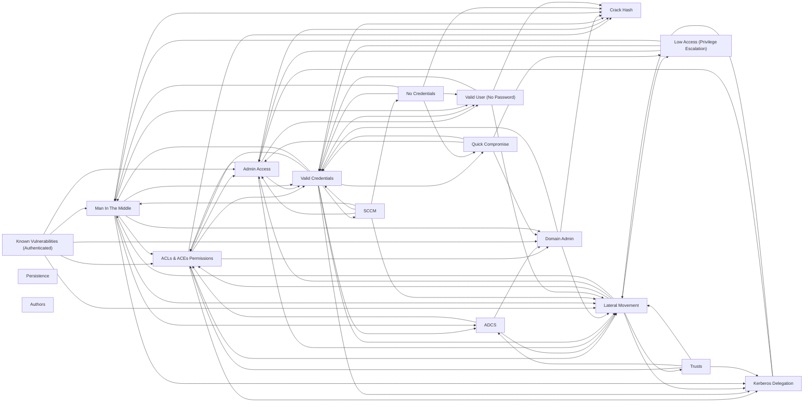

# 🗺️ Active Directory Mindmap — v2025.03

> [!abstract] Map of Content
> Obsidian conversion of the [Orange Cyberdefense AD mindmap](https://orange-cyberdefense.github.io/ocd-mindmaps/). Each box below is its own note; the nested bullets inside each note are the foldable tree branches, and `➡️` arrows are `[[wikilinks]]` to the box the technique pivots into. Original write-up: https://mayfly277.github.io/posts/AD-mindmap-2k25/

## Attack flow (grid layout)

The columns follow the engagement progression, left to right: **No creds → Valid user → Authenticated → Low access → Delegation → Admin → Domain admin**.

| Col 1 | Col 2 | Col 3 | Col 4 | Col 5 | Col 6 | Col 7 |
| --- | --- | --- | --- | --- | --- | --- |
| 🔍 [[No Credentials]] | 👤 [[Valid User (No Password)]] | 🔑 [[Valid Credentials]] | 🪜 [[Low Access (Privilege Escalation)]] | 🎫 [[Kerberos Delegation]] | 🛡️ [[Admin Access]] | 👑 [[Domain Admin]] |
| 🍒 [[Quick Compromise]] | 📡 [[Man In The Middle]] |  | 🐛 [[Known Vulnerabilities (Authenticated)]] | 📜 [[ADCS]] | ↔️ [[Lateral Movement]] | 🤝 [[Trusts]] |
| ✍️ [[Authors]] | 🔓 [[Crack Hash]] |  | 🧬 [[ACLs & ACEs Permissions]] | 🗄️ [[SCCM]] |  | ♾️ [[Persistence]] |

## Pivot graph

## All boxes

- 🔍 [[No Credentials]]
- 👤 [[Valid User (No Password)]]
- 🔑 [[Valid Credentials]]
- 🪜 [[Low Access (Privilege Escalation)]]
- 🎫 [[Kerberos Delegation]]
- 🛡️ [[Admin Access]]
- 👑 [[Domain Admin]]
- 🍒 [[Quick Compromise]]
- 📡 [[Man In The Middle]]
- 🐛 [[Known Vulnerabilities (Authenticated)]]
- 📜 [[ADCS]]
- ↔️ [[Lateral Movement]]
- 🤝 [[Trusts]]
- 🔓 [[Crack Hash]]
- 🧬 [[ACLs & ACEs Permissions]]
- 🗄️ [[SCCM]]
- ♾️ [[Persistence]]
- ✍️ [[Authors]]
